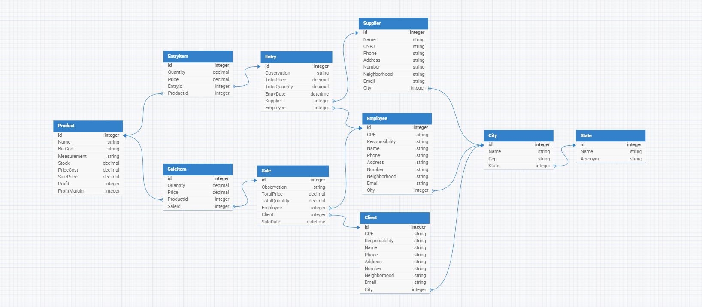

# Sistema de Vendas - Em Construção

Este repositório é parte de um projeto de aprendizado e implementação de um sistema de vendas desenvolvido com foco no backend, utilizando tecnologias modernas e boas práticas de desenvolvimento. O sistema é um CRUD (Create, Read, Update, Delete) com relacionamentos entre tabelas que representam as principais entidades do sistema.

## Tecnologias Utilizadas

-   **Java**: Linguagem principal do projeto.
-   **Spring Boot**: Framework para simplificar o desenvolvimento de aplicações Java.
-   **Spring Security**: Para controle de autenticação e segurança.
-   **PostgreSQL**: Banco de dados utilizado para armazenar as informações.
-   **HTML/CSS/Bootstrap**: Usado no front-end (com menos foco neste projeto).
-   **JavaScript e jQuery**: Para pequenas interações na interface.
-   **Git/GitHub**: Controle de versão e armazenamento do código.

## Estrutura de Dados

O sistema conta com as seguintes tabelas e seus respectivos relacionamentos:

### Diagramas de Entidade e Relacionamento

> _Observação_: O diagrama de tabelas está na pasta `images` deste repositório.

## Objetivo do Projeto

O foco principal é no backend, desenvolvendo e gerenciando:

-   Lógica de negócio.
-   Relacionamentos entre entidades.
-   Integração com banco de dados PostgreSQL.

O front-end recebe menos atenção neste momento, sendo apenas funcional e não priorizando o design ou a experiência do usuário.

**Nota:** Este projeto faz parte de um estudo e pode ser utilizado como base para aprendizado ou implementação de sistemas semelhantes.
